# PostgreSQL DB design, analysis and query 

The following is a DVD seller database that stores sales and orders data. The relational database schema is as follows:

 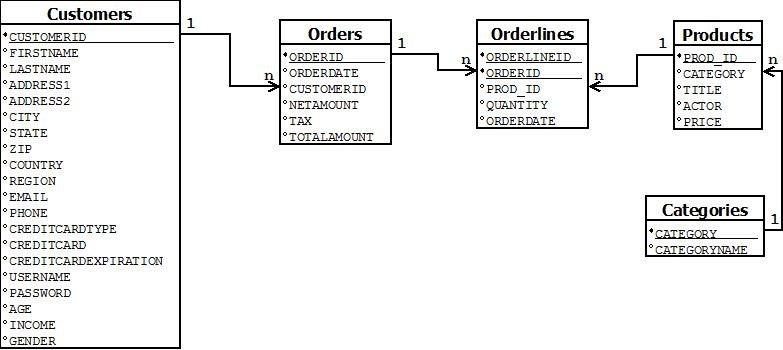

 As the schema shows, the DB stores information on:
 - Movie titles (**Products table**). Each title is related to a category (**Categories table**).
 - The Customers' (**Customers table**) information (first name, last name etc.) and their credit card number info (exp. date, type, number).
 - The orders that each customer has made (**Orders table**). For each order the DB stores the order net amount, tax amount, date the order was made and the overall amount. The order details concern the unique products, the quantities of that unique product ordered and the order date of each product (**Orderlines table**). 

 Using the above schema as well as a large dataset with real (anonymized) data the following problems need to be solved:

 ## 1. Database Design
1. Insert the data. The DB should follow the relational schema given. The deliverable are the queries and the files used for the data entry (see **1_1.sql** for answer and sample customers table below).

  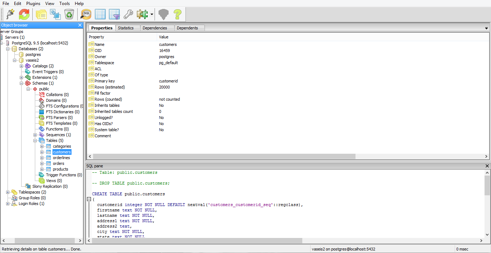

2. Remodel the database using the object-relational database model.  Following the creation of he necessary collections, types and tables implement the necessary PL/SQL scripts in order to populate the object-relational tables from the corresponding relational ones.

    Submit the UML diagram of the object relational database as well as the PL/SQL scripts.

    The UML diagram is as follows:

  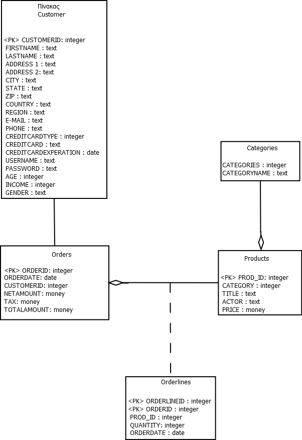

## 2. B+ Trees - Indices
Consider the last 20 records of the table Products. Assume that you are building a *B+ tree index* where *n=5* for the *primary key prod_id* of the table Products. Also assume that the tree is initially empty and that the keys are added one by one in the order that the records where input. Show the B+ tree structure after the insertion of each key:

**Step 1**: The first four values are inserted in the first node as such: 
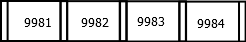

**Step 2**: The key 9985 doesn't fit in the node so the height of the tree is increased by one and the median value becomes the root:  
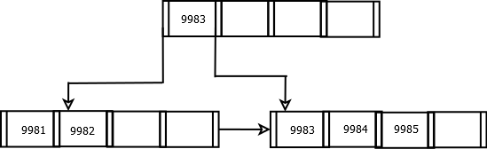

**Step 3**: The value 9986 is inserted next to 9985 since there the node is not full:
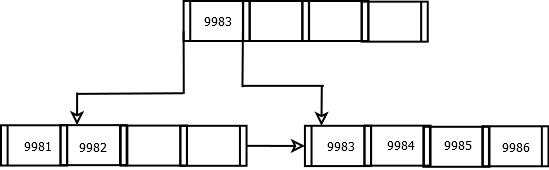

**Step 4**: 9987 cannot fit in the lower right node, so the tree's leaves increase by one and the median (9985) is sent to the root.

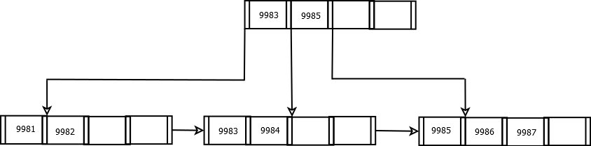

**Step 5**: Value 9988 is inserted next to 9987 since the leaf to the right isn't completed.

**Step 6**: Value 9989 doesn't fit in the right leaf show the leaves are increased by one and the median 9987 goes to the root:
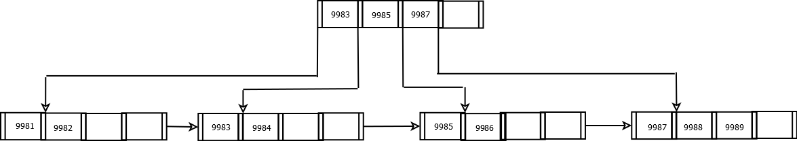

**Step 7**: Key 9990 is inserted normally in the lower right node.
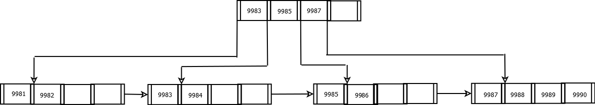

**Step 8**: Same as step 6 for key 9991.
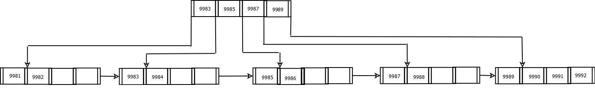

**Step 9**: Value 9992 is inserted normally in the lower right node.

**Step 10**: Since both the lower right leaf and the root are full and value 9993 can't be inserted or the median 9991 cannot be moved, the median value 9987 (out of 9983, 9985, 9987, 9989, 9991) is moved to a new root and the tree height is increased by one.
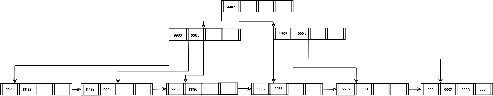

**Step 11**: 9994 is inserted next to 9994 as such:

**Step 12**: Because 9995 can't be inserted, the leaves are increased by one with 9993 moving to a parent node.
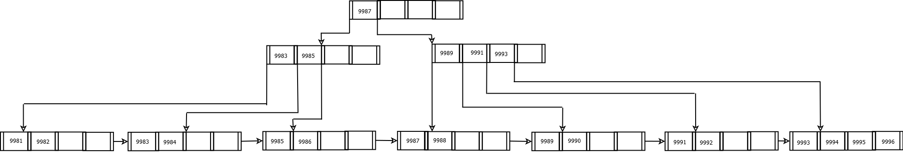 

**Step 13**: Value 9996 is inserted to the appropriate leaf.
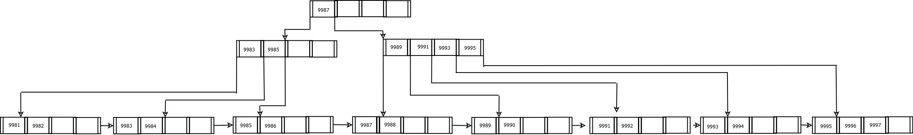

**Step 14**: Increasing the leaves by one and moving 9995 to the parent node since 9997 cannot be inserted.

**Step 15**: Value 9998 is inserted normally in the tree.
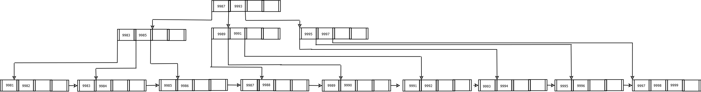

**Step 16**: Key 9999 cannot be inserted in the lower right leaf so the median 9997 has to move to the parnet node which is in turn full. Thus the median 9993 (out of 9989, 9991, 9993, 9995, 9997) moves to the root of the tree. The overall tree nodes are increased by one, and the tree takes the following shape:

**Step 17**: Value 10000 is inserted in the lower right leaf and our tree takes its final form:

